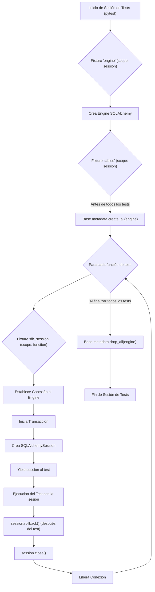

# Estrategia de Testing para la Integración de SQLAlchemy con Pytest

Este documento describe el plan para refactorizar los tests de integración de SQLAlchemy en el archivo `src/pkm_app/tests/integration/infrastructure/test_sqlalchemy_models.py` utilizando `pytest` y sus fixtures para una gestión eficiente y limpia de la base de datos.

## Objetivos

*   Asegurar que cada test se ejecute en un entorno aislado.
*   Limpiar automáticamente los datos generados por los tests.
*   Mejorar la legibilidad y mantenibilidad de los tests.
*   Utilizar las mejores prácticas de `pytest` para la gestión de recursos como conexiones de base de datos y transacciones.

## Plan de Modificación

1.  **Introducir `pytest` y Refactorizar Estructura:**
    *   Asegurar que `pytest` sea una dependencia del proyecto (generalmente añadido en `pyproject.toml` o `requirements.txt`).
    *   Convertir las clases de test que heredan de `unittest.TestCase` a funciones de test estándar de `pytest` (ej. `def test_nombre_funcion():`) o clases de test simples que no requieran herencia de `unittest.TestCase`.
    *   Reemplazar los métodos `setUp` y `tearDown` por fixtures de `pytest` con el alcance adecuado (`function`, `class`, `module`, `session`).
    *   Adaptar las aserciones de `unittest` (ej. `self.assertEqual(a, b)`, `self.assertTrue(x)`) al estilo de `pytest` (ej. `assert a == b`, `assert x`).

2.  **Implementar Fixtures de `pytest` para la Gestión de la Base de Datos:**

    *   **`engine` fixture (alcance: `session`):**
        *   Responsable de crear una única instancia del `Engine` de SQLAlchemy para toda la sesión de tests.
        *   Utilizará la `SYNC_DATABASE_URL` (obtenida de las variables de entorno, como en el script actual).
        *   Esta instancia se reutilizará en todos los tests para evitar la sobrecarga de crear múltiples engines.

    *   **`tables` fixture (alcance: `session`):**
        *   Dependerá del fixture `engine`.
        *   **Antes de que se ejecuten todos los tests (setup):** Ejecutará `Base.metadata.create_all(engine)` para crear todas las tablas definidas en los modelos de SQLAlchemy. Esto asegura que la estructura de la base de datos esté lista.
        *   **Después de que se ejecuten todos los tests (teardown):** Ejecutará `Base.metadata.drop_all(engine)` para eliminar todas las tablas. Esto limpia la base de datos después de la ejecución completa de la suite de tests, dejándola en su estado original.

    *   **`db_session` fixture (alcance: `function`):**
        *   Este es el fixture clave para el aislamiento de los tests. Dependerá del fixture `tables` (para asegurar que las tablas existan) y del `engine`.
        *   Para cada función de test individual:
            1.  Establecerá una conexión al `engine`.
            2.  Comenzará una transacción anidada (SQLAlchemy's nested transaction) o una transacción real si el dialecto de la base de datos y la configuración lo soportan bien para tests. El objetivo es que esta transacción envuelva todas las operaciones del test.
            3.  Creará una instancia de `SQLAlchemySession` (la `SessionLocal` actual o una similar) vinculada a esta conexión y transacción.
            4.  Hará `yield` de esta sesión al test. El test utilizará esta sesión para interactuar con la base de datos.
            5.  Al finalizar el test (después del `yield`), independientemente de si el test pasó o falló:
                *   Hará `rollback()` de la transacción. Esto deshará todos los cambios (inserts, updates, deletes) realizados por el test en la base de datos.
                *   Cerrará la sesión de SQLAlchemy (`session.close()`).
                *   Liberará la conexión al pool (`connection.close()`).
        *   Este enfoque asegura que cada test comience con un estado de datos "limpio" (sin datos de tests anteriores) y no deje rastros que puedan afectar a tests subsecuentes.

3.  **Adaptar los Tests Existentes:**
    *   Modificar las funciones de test (anteriormente métodos de clase) para que acepten `db_session` como un argumento. Pytest inyectará automáticamente el fixture.
    *   Utilizar esta `db_session` inyectada para todas las operaciones de base de datos dentro de los tests (ej. `db_session.add(objeto)`, `db_session.query(...)`).
    *   Eliminar las llamadas explícitas a `db.commit()` dentro de los tests. Dado que cada test se ejecuta dentro de una transacción que se revierte, los `commit()` no son necesarios para la persistencia entre tests y pueden incluso interferir con el patrón de rollback si no se manejan con cuidado. Si un `commit()` es necesario para que SQLAlchemy genere IDs o actualice estados *dentro* del mismo test antes de una operación subsiguiente, se puede mantener, ya que el `rollback()` general del fixture `db_session` anulará estos commits al final del test.
    *   La clase `TestDatabaseSetup` (si se mantiene) también se adaptará para usar `pytest` y podría utilizar el fixture `engine` para probar la conexión.

## Diagrama de Flujo de Fixtures con `pytest`

## Consideraciones Adicionales

*   **Dependencias:** Asegurarse de que `pytest` y `pytest-cov` (para cobertura) estén en las dependencias de desarrollo.
*   **Configuración de Pytest:** Se puede usar un archivo `pytest.ini` o `pyproject.toml` para configurar `pytest` si es necesario (ej. marcar tests, rutas).
*   **Velocidad:** Usar una base de datos en memoria como SQLite para tests unitarios rápidos si es posible, aunque para tests de integración con características específicas de PostgreSQL (como JSONB, pgvector), se debe usar una base de datos PostgreSQL de prueba. El plan actual asume una base de datos PostgreSQL de prueba.

Este plan proporciona una base sólida para mejorar la infraestructura de testing.
